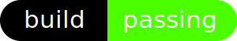

<p align="center"></p>

<p align="center">
  
  
</p>

# Sandglass
Modular development for websites using 
<a href="https://www.webcomponents.org/introduction" target="_blank" rel="noopener noreferrer">webcomponents</a>
and <a href="https://handlebarsjs.com/" target="_blank" rel="noopener noreferrer">handlebars</a>. 
No installations necessary. Use during develpoment, strip in production.

## Browser Support

 |  |  |  |  |  |
--- | --- | --- | --- | --- | --- |
Latest ✔ | Latest ✔ | Latest ✔ | Latest ✔ | Latest ✔ | 11 ✔ |

## Getting Started

### Installing

Download or clone this repo. You can grab the latest version of handlebars from <a href="https://handlebarsjs.com/" target="_blank" rel="noopener noreferrer">here</a>. 

```
git clone https://github.com/dibgerge/ml-coursera-python-assignments.git
```

## Usage

### Setup

```
<head>
  ...
  <!-- You may use a CDN here -->
  <script src="./handlebars-v4.1.0.js"></script>
  ...
</head>
```

```
<body>
  ...
  <script src="./index.js" type="module"></script>
  ...
</body>
```

### Use

Use the tag &lt;div-ision&gt; with data-to-use attribue to create modules.

```
<div-ision data-to-use="./path/to/nested/divison.html"></div-ision>
```

#### divison.html must be as follows

Each module or chunk must be a HTML file, and must have a single root component

./path/to/nested/divison.html
```
  <div>
    <p> Hello! I am a chunk. </p>
  </div>
```

You can provide styling to the module in the same file

```
  <div>
    <script>
      p {
        color: blue;
      }
    </script>
    <p> Hello! I am a chunk. </p>
  </div>
```
You can nest &lt;div-ision&gt; tags inside division tag.

```
  <div>
    <script>
      p {
        color: blue;
      }
    </script>
    <p> Hello! I am a chunk. </p>
    <div-ision data-to-use="./path/to/further/nested/divison.html"></div-ision>
  </div>
```

### Serve

Start a server and serve the file. May work without setting up a server in firefox, but requires serving over a server for other browsers. 

```
 http-server index.html
```

## Built With

* [Web Components](https://www.webcomponents.org/introduction) - Web platform APIs that allow you to create new custom tags.
* [Handlebars](https://handlebarsjs.com/) - Build semantic templates effectively with no frustration. 

## Contributing

Please read [CONTRIBUTING.md](https://gist.github.com/PurpleBooth/b24679402957c63ec426) for details on our code of conduct.

## Authors

* **Uzair Fasih** - *Initial work*

## License

This project is licensed under the MIT License
