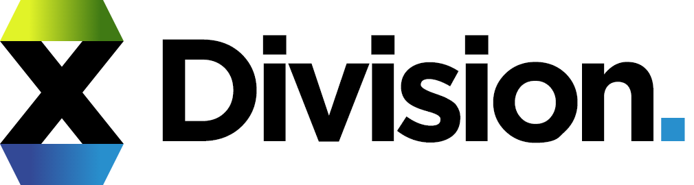
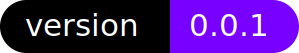

<p align="center"></p>

<p align="center">
  
</p>

# Division.
Modular development for websites using 
<a href="https://www.webcomponents.org/introduction" target="_blank" rel="noopener noreferrer">webcomponents</a>
and <a href="https://handlebarsjs.com/" target="_blank" rel="noopener noreferrer">handlebars</a>. 
No installations necessary. Use during develpoment, strip in production.

## Browser Support

 |  |  |  |  |  |
--- | --- | --- | --- | --- | --- |
Latest ✔ | Latest ✔ | Latest ✔ | Latest ✔ | Latest ✔ | 11 ✔ |

## Getting Started

### Installing

Download or clone this repo. You can grab the latest version of handlebars from <a href="https://handlebarsjs.com/" target="_blank" rel="noopener noreferrer">here</a>. 

```
git clone https://github.com/Uzair-Fasih/Division.git
```


```
or just download division.min.js and handlebars.js (optional)
```

## Usage

### Setup

```HTML
<head>
  ...
  <!-- You may use a CDN here -->
  <script src="./handlebars-v4.1.0.js"></script>
  <script src="./division.min.js" type="module"></script>
  ...
</head>
```

### Use

Use the tag &lt;div-ision&gt; with ``"data-to-use"`` attribue to create modules.

```HTML
<div-ision data-to-use="./path/to/nested/divison.html"></div-ision>
```
Each module or chunk must be a HTML file, may or may not have a single root tag

./path/to/nested/divison.html
```HTML
  <div>
    <p> Hello! I am a chunk. </p>
  </div>
```
or
```HTML
  <p> Hello! I am a chunk. </p>
  <p> Me too! </p>
```

You can provide styling to the module in the same file

```HTML
  <div>
    <style>
      p {
        color: blue;
      }
    </style>
    <p> Hello! I am a chunk. </p>
  </div>
```
You can nest &lt;div-ision&gt; tags inside division tag.

```HTML
  <div>
    <script>
      p {
        color: blue;
      }
    </script>
    <p> Hello! I am a chunk. </p>
    <div-ision data-to-use="./path/to/further/nested/divison.html"></div-ision>
  </div>
```

### Serve

Start a server and serve the file. May work without setting up a server in firefox, but requires serving over a server for other browsers. 

```
 http-server index.html
```

## Built With

* [Web Components](https://www.webcomponents.org/introduction) - Web platform APIs that allow you to create new custom tags.
* [Handlebars](https://handlebarsjs.com/) - Build semantic templates effectively with no frustration. 

## Contributing

As of now, the project lacks direction and will be continued to be updated. You can contribute by suggesting features or by making changes that reflect and extend the idea of the project.

## Authors

* **Uzair Fasih** - *Initial Commit*

## License

This project is licensed under the MIT License
